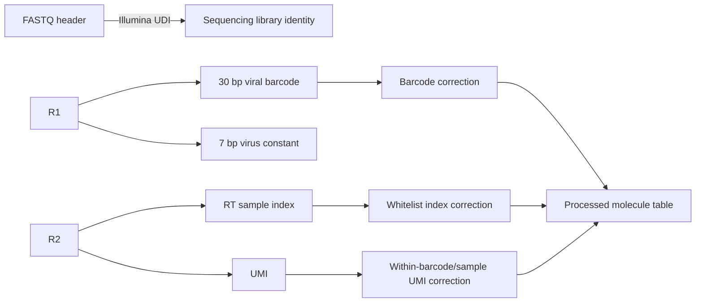
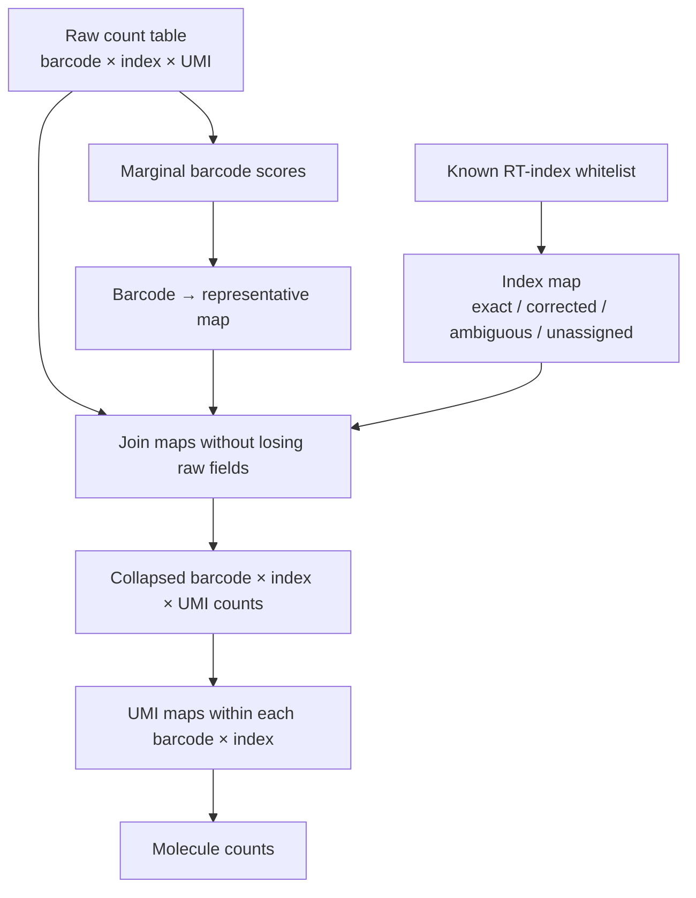

# pymutscan

[](https://github.com/andrestrocyte/pymutscan/actions/workflows/ci.yml)
[](https://www.python.org/)
[](#license)

**Fast, information-preserving MAPseq FASTQ processing in Python.** `pymutscan`
streams paired reads into an auditable barcode/sample-index/UMI count store,
corrects each molecular field at the right biological grain, and exports
Python-, command-line-, and R-compatible processed datasets.

The project started from a practical scaling problem in the FMI
[`mutscan`](https://github.com/fmicompbio/mutscan) workflow: early-pooled MAPseq
samples were represented by a long composite sequence containing the viral
barcode, UMI, and RT sample index. As datasets grew, the number of unique
composite keys made similarity collapse take hours. `pymutscan` changes the
data model first, then specializes the common fixed-length, Hamming-radius-one
search mathematically.

> **Scope:** `pymutscan` reimplements and optimizes the MAPseq-relevant FASTQ
> digestion, sequence grouping, index correction, UMI correction, persistence,
> and export path. It is **not** a drop-in replacement for every statistical,
> plotting, or general deep-mutational-scanning feature in the R `mutscan`
> package.

---

## Table of contents

- [Why this repository exists](#why-this-repository-exists)
- [MAPseq sequence identities](#mapseq-sequence-identities)
- [What differs from mutscan](#what-differs-from-mutscan)
- [Mathematical algorithm](#mathematical-algorithm)
- [Measured performance](#measured-performance)
- [Data model and provenance](#data-model-and-provenance)
- [Installation](#installation)
- [Quick start](#quick-start)
- [Read-layout configuration](#read-layout-configuration)
- [Command reference](#command-reference)
- [Jupyter analysis notebooks](#jupyter-analysis-notebooks)
- [Synthetic example dataset](#synthetic-example-dataset)
- [Quality control](#quality-control)
- [Template-switch analysis](#template-switch-analysis)
- [R and RStudio interoperability](#r-and-rstudio-interoperability)
- [Python API](#python-api)
- [Testing and CI](#testing-and-ci)
- [Repository layout](#repository-layout)
- [Limitations and scientific decisions](#limitations-and-scientific-decisions)
- [Troubleshooting](#troubleshooting)
- [Roadmap](#roadmap)
- [License](#license)

---

## Why this repository exists

MAPseq associates random RNA barcodes with neuronal projection patterns. A
typical early-pooling library must preserve three different sequence identities:

1. a viral barcode identifying the labeled lineage/neuron;
2. an RT sample index identifying the dissected sample before pooling; and
3. a UMI identifying an original molecule before PCR amplification.

The original analysis used R `mutscan`, which is a capable general package for
multiplexed assays of variant effect. In one MAPseq configuration, however,
forward and reverse `V` segments were concatenated into a feature key. For a
30-base barcode, 16-base UMI, and 6-base sample index, the clustering object was
effectively a 52-base composite identity.

That causes two problems:

- **Computational:** the number of unique barcode/UMI/index combinations is
  much larger than the number of unique barcodes.
- **Scientific:** barcode error correction, known-index assignment, and UMI
  molecule deduplication answer different questions and have different priors.

`pymutscan` therefore stores the original count grain first and runs the three
correction problems separately. Raw observations and all mappings remain
available.

---

## MAPseq sequence identities



The Illumina UDI encoded in the FASTQ header identifies the sequenced library.
It is not the same as the RT sample index embedded in R2, which identifies one
of the samples pooled before amplification.

The default MAPseq layout shipped by the CLI is:

| Read | Segment | Length | Role |
|---|---|---:|---|
| R1 | viral barcode | 30 | biological barcode to correct by abundance |
| R1 | viral constant | 7 | read identity/filter |
| R1 | tail | remaining | ignored |
| R2 | UMI | 16 | original-molecule identity |
| R2 | RT sample index | 6 | early-pool sample identity |
| R2 | tail | remaining | ignored |

All lengths are configurable. The repository also documents the observed
30/18/14 layout used by another MAPseq experiment.

---

## What differs from mutscan

The largest difference is **what is clustered**, not merely R versus Python.

### Composite-key workflow

A `mutscan` configuration using forward `VCS` and reverse `VVS` produces a
feature name equivalent to:

```text
barcode[30] + "_" + UMI[16] + sample_index[6]
```

`groupSimilarSequences()` then greedily searches the complete feature strings.
Two one-error barcodes do not collapse if their UMI or index also differs beyond
the total tolerance.

### pymutscan workflow

`pymutscan` begins with a normalized table:

```text
barcode | sample_index | UMI | read_count
```

It then performs:

1. **Barcode marginalization:** sum read support across sample index and UMI.
2. **Barcode-only grouping:** compare only fixed-length viral barcodes.
3. **Mapping join:** replace each observed barcode by its representative while
   retaining the original table.
4. **Index correction:** assign observed RT indices to a known whitelist only
   when the closest match is unique and within tolerance.
5. **UMI correction:** optionally group UMIs only within each representative
   barcode/corrected-index stratum.
6. **Molecule summary:** count UMI representatives and supporting reads per
   representative barcode and sample.



### Behavior intentionally preserved

For barcode-only clustering, the Python implementation preserves the R
`groupSimilarSequences()` greedy semantics:

- decreasing score order;
- lexicographic ordering for score ties;
- first still-active sequence becomes the representative;
- representatives claim still-active neighbors within the Hamming tolerance;
- `collapseMinScore` and `collapseMinRatio` are honored.

The resulting map is not necessarily the same as connected-components
clustering. Representative order matters by design.

### Behavior intentionally separated

| Problem | Evidence | pymutscan rule |
|---|---|---|
| Barcode substitution | observed barcode abundance | greedy abundance-ordered grouping |
| RT-index substitution | known index whitelist | unique nearest allowed index or explicit unresolved status |
| UMI substitution | molecules within one barcode/sample | separate within-stratum grouping |

See [`docs/algorithm.md`](docs/algorithm.md) and
[`docs/migration_from_mutscan.md`](docs/migration_from_mutscan.md) for more
detail.

---

## Mathematical algorithm

Let:

- \(B\) be the number of unique observed barcodes;
- \(L\) be barcode length;
- \(\Sigma = \{A,C,G,T\}\);
- \(d_H(x,y)\) be Hamming distance;
- \(r=1\) be the common correction radius.

For a fixed-length DNA string \(x\), the complete radius-one neighborhood is:

\[
N_1(x) = \{x\}\;\cup\;
\{x^{(i \leftarrow b)} : 1\le i\le L,\ b\in\Sigma,\ b\ne x_i\}.
\]

Its maximum size is:

\[
|N_1(x)| = 1 + L(|\Sigma|-1) = 1 + 3L.
\]

For a 30-base barcode, this is exactly **91 possible hash probes** per
representative—one original string and 90 single substitutions.

### Expected complexity

With an observed-sequence hash table:

\[
T(B,L,r=1)=O(BL|\Sigma|),\qquad S(B)=O(B).
\]

For DNA, \(|\Sigma|=4\) is constant, so the practical radius-one path is
\(O(BL)\).

The previous workflow searched a BK-tree over \(M\) composite keys, where
typically \(M \gg B\). BK-trees are useful general metric indexes, but query
performance depends on the metric-space distribution and does not eliminate
the cardinality created by UMI/index combinations.

### Exact greedy procedure

```text
sort barcodes by (-score, lexicographic sequence)
active = set(all barcodes)

for candidate in sorted barcodes:
    if candidate is inactive:
        continue
    if candidate score is below collapseMinScore:
        map every remaining barcode to itself
        stop
    for neighbor in all 1 + 3L radius-one strings:
        if neighbor is active and score ratio is allowed:
            map neighbor to candidate
            remove neighbor from active
```

Because candidate enumeration covers the full Hamming-radius-one set, this is
an exact search—not locality-sensitive hashing or an approximate neighbor
method.

For radii greater than one, version 0.2 uses a correctness-first exhaustive
fallback. The performance specialization and benchmark claims apply to radius
one.

---

## Measured performance

The benchmark used the first one million paired reads from a real MAPseq
library, with identical radius-one, minimum-score, and ratio settings.

| Operation | Clustering inputs | Time | Representatives |
|---|---:|---:|---:|
| R mutscan, composite barcode/UMI/index keys | 302,674 | 442.7 s | 280,737 |
| R mutscan, barcode-only keys | 43,915 | 3.856 s | 31,665 |
| pymutscan, barcode grouping only | 43,915 | 0.717 s | 31,665 |
| pymutscan, grouping + mapping write + re-aggregation | 43,915 | 1.725 s | 31,665 |

Key findings:

- Marginalizing to barcodes reduced clustering cardinality by **85.5%**.
- The complete proposed collapse step was **256.6× faster** than the measured
  composite-key R collapse.
- Python and R barcode-only mappings differed for **0 of 43,915** barcodes in
  the slice and **0 of 142,823** barcodes in the full validation dataset.
- The full Python FASTQ run retained **13,053,806** reads, exactly matching the
  existing RDS retained-read total.

The composite R timing initially experienced CPU contention from unrelated RDS
inspection processes, so the exact 256.6× value is not a hardware-pure
microbenchmark. The result is nevertheless well beyond 10×, and the
uncontended barcode-only comparison plus exact map equality provide independent
validation. Full methodology is in
[`docs/benchmark_methodology.md`](docs/benchmark_methodology.md).

---

## Data model and provenance

SQLite is the canonical processed-data container. It is portable, queryable
from Python/R/SQL tools, supports datasets larger than memory, and keeps every
mapping adjacent to the data it transforms.

| Table | Grain | Purpose |
|---|---|---|
| `raw_counts` | observed barcode × raw index × raw UMI | original retained observations |
| `qc` | metric | FASTQ filtering counts |
| `run_metadata` | key/value | paths, layout, thresholds, format version |
| `barcode_scores` | observed barcode | score used for barcode clustering |
| `barcode_mapping` | observed barcode | representative assignment |
| `sample_index_mapping` | observed index | exact/corrected/ambiguous/unassigned decision |
| `collapsed_counts` | representative barcode × normalized index × raw UMI | barcode/index-corrected reads |
| `umi_mapping` | barcode × index × raw UMI | UMI representative assignment |
| `umi_collapsed_counts` | barcode × index × UMI representative | reads after UMI correction |
| `molecule_counts` | barcode × index | molecule representatives and read support |

No correction overwrites `raw_counts`. Filtering and collapsing parameters are
recorded in `run_metadata`.

---

## Installation

### From GitHub

```bash
python -m venv .venv
source .venv/bin/activate       # Windows: .venv\Scripts\activate
python -m pip install --upgrade pip
python -m pip install "pymutscan @ git+https://github.com/andrestrocyte/pymutscan.git"
```

### Editable development install

```bash
git clone https://github.com/andrestrocyte/pymutscan.git
cd pymutscan
python -m venv .venv
source .venv/bin/activate
python -m pip install -e ".[dev,notebooks]"
```

The core package uses only the Python standard library. Notebook and developer
dependencies are optional.

### Requirements

- Python 3.10–3.13
- gzip-compressed or plain paired FASTQ files
- R plus `Matrix`, `S4Vectors`, and `SummarizedExperiment` only when generating
  compatibility RDS files

---

## Quick start

### Run the bundled synthetic example

```bash
python scripts/generate_synthetic_mapseq.py
python scripts/run_example_pipeline.py
```

Outputs are written to `examples/output/` and include SQLite plus compressed
TSV exports.

### Process a 30/16/6 MAPseq library

```bash
pymutscan digest \
  --r1 reads_R1.fastq.gz \
  --r2 reads_R2.fastq.gz \
  --database results/mapseq.sqlite \
  --barcode-length 30 \
  --umi-length 16 \
  --sample-index-length 6

pymutscan map-indices \
  --database results/mapseq.sqlite \
  --sample-index CGTGAT \
  --sample-index ACATCG \
  --sample-index GCCTAA \
  --max-distance 1

pymutscan collapse \
  --database results/mapseq.sqlite \
  --max-distance 1 \
  --min-score 2 \
  --min-ratio 0 \
  --min-combo-reads 1

pymutscan collapse-umis \
  --database results/mapseq.sqlite \
  --max-distance 1

pymutscan export \
  --database results/mapseq.sqlite \
  --table molecule_counts \
  --output results/molecule_counts.tsv.gz
```

---

## Read-layout configuration

The digest command expects contiguous fields at the beginning of each read:

```text
R1 = barcode + constant + ignored tail
R2 = UMI + sample index + ignored tail
```

Defaults:

```text
barcode_length       = 30
UMI_length           = 16
sample_index_length  = 6
constant_forward     = CCGTACT / CTGTACT / TCGTACT / TTGTACT
minimum mean Phred   = 20
allowed N bases      = 0 in barcode, UMI, and sample index
```

For an 18-base UMI and 14-base index:

```bash
pymutscan digest --r1 R1.fastq.gz --r2 R2.fastq.gz \
  --database results.sqlite --barcode-length 30 \
  --umi-length 18 --sample-index-length 14
```

Multiple accepted constants may be passed by repeating `--constant-forward`.

---

## Command reference

### `pymutscan digest`

Streams paired FASTQs, applies length/constant/ambiguity/quality filters, and
updates the on-disk `raw_counts` table in batches.

Important options:

| Option | Default | Meaning |
|---|---:|---|
| `--barcode-length` | 30 | R1 barcode bases |
| `--umi-length` | 16 | leading R2 UMI bases |
| `--sample-index-length` | 6 | R2 bases following UMI |
| `--constant-forward` | four viral constants | accepted R1 constant; repeatable |
| `--min-average-phred` | 20 | minimum mean quality in barcode and R2 variable fields |
| `--max-reads` | all | bounded test/debug run |

### `pymutscan map-indices`

Maps every observed RT index to a known whitelist. A correction is accepted
only if the nearest allowed index is unique and within `--max-distance`.
Otherwise, status is `ambiguous` or `unassigned`. Unresolved values remain raw
in downstream grouping rather than being silently forced.

### `pymutscan collapse`

Creates barcode marginal scores, the barcode mapping, and re-aggregated
barcode/index/UMI counts. `--min-combo-reads` implements optional pre-collapse
filtering such as the lenient two-read sensitivity proposed for large
qualitative datasets.

### `pymutscan collapse-umis`

Collapses UMIs separately within every representative-barcode/sample-index
stratum. Version 0.2 uses equal UMI scores and lexicographic greedy priority to
match the original mutscan-style UMI representative choice.

### `pymutscan export`

Exports one allowed SQLite table as TSV or gzip-compressed TSV when the output
name ends in `.gz`.

---

## Jupyter analysis notebooks

The notebooks are Python equivalents of the exploratory RStudio workflows used
to generate and inspect processed MAPseq datasets. Each runs top-to-bottom and
uses only synthetic public data.

| Notebook | Question answered | Primary output |
|---|---|---|
| `01_process_fastqs.ipynb` | Can the paired reads be digested, indexed, barcode-collapsed, and UMI-collapsed? | example SQLite and TSV tables |
| `02_quality_control.ipynb` | Which filters removed reads, and how well did index mapping work? | QC summaries and plots |
| `03_template_switch_analysis.ipynb` | Which UMIs are associated with multiple barcode representatives? | thresholded candidate table |
| `04_barcode_sample_matrix.ipynb` | Which corrected barcodes occur in which samples and with how many molecules? | barcode × sample matrix and heatmap |

Launch locally:

```bash
python -m pip install -e ".[notebooks]"
python scripts/generate_synthetic_mapseq.py
jupyter lab notebooks/
```

CI executes every notebook from a clean checkout.

---

## Synthetic example dataset

`examples/synthetic/` contains no biological data. It is generated with a fixed
seed and includes:

- three canonical 30-base barcodes;
- a one-substitution barcode error;
- two known six-base RT indices and one one-substitution index error;
- a one-substitution UMI error;
- a UMI deliberately shared across two distant barcodes as a template-switch
  candidate;
- constant mismatch, low-quality, ambiguous-barcode, and ambiguous-UMI reads.

`truth.json` records expected QC totals and mappings. The FASTQs can be
regenerated byte-for-byte with:

```bash
python scripts/generate_synthetic_mapseq.py
```

---

## Quality control

The `qc` table records:

- total read pairs;
- wrong length;
- constant mismatch;
- ambiguous barcode;
- ambiguous UMI;
- ambiguous sample index;
- low variable-region quality;
- retained reads.

Useful invariants:

```sql
SELECT sum(read_count) FROM raw_counts;
SELECT sum(read_count) FROM collapsed_counts;
SELECT sum(read_count) FROM umi_collapsed_counts;
SELECT sum(read_count) FROM molecule_counts;
```

All totals should agree unless an explicit `min_combo_reads` filter is applied.
The notebooks demonstrate these reconciliations.

---

## Template-switch analysis

A UMI observed with multiple barcode representatives can indicate template
switching, barcode error, UMI collision, or another artifact. `pymutscan` does
not label such events causally; it exposes the evidence at the correct grain.

A simple candidate query is:

```sql
SELECT sample_index, umi,
       count(DISTINCT barcode) AS n_barcodes,
       sum(read_count) AS reads
FROM collapsed_counts
GROUP BY sample_index, umi
HAVING count(DISTINCT barcode) > 1
ORDER BY reads DESC;
```

The template-switch notebook adds per-barcode support and lenient read
thresholds so sequencing errors are not confused with high-support shared UMIs.

---

## R and RStudio interoperability

SQLite and TSV outputs can be read directly from R. To create a
`SummarizedExperiment` RDS:

```bash
pymutscan export --database results.sqlite \
  --table umi_collapsed_counts \
  --output results/umi_collapsed_counts.tsv.gz

Rscript scripts/export_summarized_experiment.R \
  results/umi_collapsed_counts.tsv.gz \
  results/pymutscan.rds \
  sample_name \
  results/barcode_mapping.tsv.gz
```

The RDS row metadata contains explicit `barcode`, `sampleIndex`, and `umi`
columns instead of requiring downstream code to parse one composite identifier.

---

## Python API

```python
from pymutscan import (
    MapSeqConfig,
    collapse_database,
    collapse_umis,
    digest_fastqs,
    map_sample_indices,
)

config = MapSeqConfig(
    barcode_length=30,
    umi_length=16,
    sample_index_length=6,
)

digest_fastqs("R1.fastq.gz", "R2.fastq.gz", "results.sqlite", config=config)
map_sample_indices("results.sqlite", ["CGTGAT", "ACATCG"], max_distance=1)
collapse_database(
    "results.sqlite",
    collapse_max_dist=1,
    collapse_min_score=2,
    collapse_min_ratio=0,
)
collapse_umis("results.sqlite", collapse_max_dist=1)
```

For direct sequence grouping:

```python
from pymutscan import group_similar_sequences

mapping = group_similar_sequences(
    sequences=["AACGT", "AATGT", "TTTTT"],
    scores=[10, 1, 5],
    collapse_max_dist=1,
    collapse_min_score=2,
)
```

---

## Testing and CI

Run locally:

```bash
python -m pip install -e ".[dev,notebooks]"
ruff check src tests scripts
python -m unittest discover -s tests -v
python -m compileall -q src tests scripts
```

GitHub Actions runs:

- lint, unit, and integration tests on Python 3.10, 3.11, 3.12, and 3.13;
- every example notebook top-to-bottom on Python 3.12;
- wheel and source-distribution builds plus `twine check`.

Tests cover published mutscan mapping examples, lexicographic ties, paired FASTQ
digestion, barcode-only collapsing with retained UMIs/indices, independent
sample-index mapping, within-stratum UMI collapse, molecule counts, and the
bundled synthetic truth dataset.

---

## Repository layout

```text
pymutscan/
├── .github/workflows/ci.yml
├── examples/synthetic/           # deterministic public paired FASTQs + truth
├── notebooks/                    # processing, QC, template-switch, matrix analyses
├── scripts/
│   ├── export_summarized_experiment.R
│   ├── generate_synthetic_mapseq.py
│   └── run_example_pipeline.py
├── src/pymutscan/
│   ├── cli.py
│   ├── collapse.py               # exact greedy radius-one grouping
│   ├── fastq.py                  # streaming paired FASTQ reader
│   └── pipeline.py               # SQLite workflow and exports
├── tests/
├── docs/
├── pyproject.toml
└── README.md
```

---

## Limitations and scientific decisions

- The optimized algorithm is specialized for fixed-length DNA at Hamming
  radius one. Larger radii currently use an exhaustive fallback.
- Hamming distance models substitutions, not insertions/deletions.
- Greedy abundance clustering is order-dependent and is not connected-component
  clustering.
- Barcode neighbors can represent either sequencing errors or genuinely
  distinct biological barcodes. Distance and abundance thresholds remain
  scientific parameters, not universal constants.
- Sample-index rescue requires a validated whitelist. Ambiguous or distant
  observations are retained as unresolved.
- Equal-score lexicographic UMI clustering matches the implemented mutscan-like
  behavior but is not the only UMI error model. Directional abundance methods
  may be preferable for some assays.
- The current digest path targets contiguous MAPseq fields at the start of R1
  and R2. It does not yet implement every `S/U/C/V/P`, primer, reverse-complement,
  paired-overlap, or wild-type mutation feature of general R `mutscan`.
- Template-switch candidates are associations, not proof of mechanism.

---

## Troubleshooting

### `constant_mismatch` is unexpectedly high

Check the R1 field lengths and accepted constants. Inspect the first few reads
without loading the full file:

```bash
gzip -cd reads_R1.fastq.gz | head -8
```

### Most sample indices are unassigned

Confirm UMI and index lengths, index orientation, and whitelist sequences. Query
the observed strings:

```sql
SELECT sample_index, sum(read_count) AS reads
FROM raw_counts
GROUP BY sample_index
ORDER BY reads DESC
LIMIT 20;
```

### Read totals differ after collapse

Check whether `min_combo_reads` was greater than one. Inspect stored parameters:

```sql
SELECT * FROM run_metadata ORDER BY key;
```

### Paired FASTQ names differ

`pymutscan` requires synchronized R1/R2 records. Re-pair or regenerate the
files upstream rather than suppressing the validation.

### Notebook kernel cannot import pymutscan

Install the repository into the active environment and restart the kernel:

```bash
python -m pip install -e ".[notebooks]"
```

---

## Roadmap

- native configuration files and named experiment presets;
- optimized exact search for radius two;
- optional abundance-directional UMI correction;
- multi-file/lane ingestion with explicit library identities;
- richer sample metadata and sparse barcode-by-sample exports;
- additional mutscan-compatible FASTQ composition elements;
- benchmark datasets and memory profiling at larger scales.

---

## License

`pymutscan` is released under the [MIT License](LICENSE).

The FMI `mutscan` project is a separate R package with its own authors,
copyright, license, and scope. `pymutscan` does not vendor its source code.

