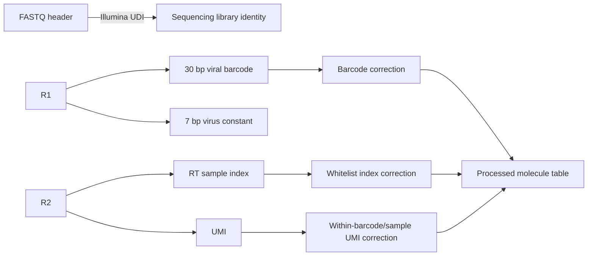
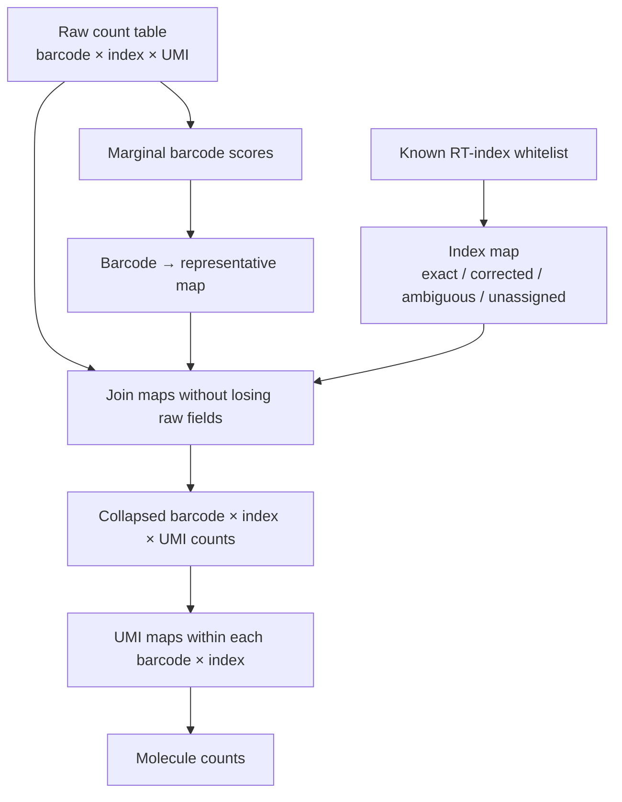

# pymutscan

[](https://github.com/andrestrocyte/pymutscan/actions/workflows/ci.yml)
[](https://www.python.org/)
[](#license)

**Fast, information-preserving MAPseq FASTQ processing in Python.** `pymutscan`
streams paired reads into an auditable barcode/sample-index/UMI count store,
corrects each molecular field at the right biological grain, and exports
Python-, command-line-, and R-compatible processed datasets.

The project started from a practical scaling problem in the FMI
[`mutscan`](https://github.com/fmicompbio/mutscan) workflow: early-pooled MAPseq
samples were represented by a long composite sequence containing the viral
barcode, UMI, and RT sample index. As datasets grew, the number of unique
composite keys made similarity collapse take hours. `pymutscan` changes the
data model first, then specializes the common fixed-length Hamming-radius-one
and radius-two searches mathematically.

> **Scope:** `pymutscan` reimplements and optimizes the MAPseq-relevant FASTQ
> digestion, sequence grouping, index correction, UMI correction, persistence,
> and export path. It is **not** a drop-in replacement for every statistical,
> plotting, or general deep-mutational-scanning feature in the R `mutscan`
> package.

---

## Table of contents

- [Why this repository exists](#why-this-repository-exists)
- [MAPseq sequence identities](#mapseq-sequence-identities)
- [What differs from mutscan](#what-differs-from-mutscan)
- [Mathematical algorithm](#mathematical-algorithm)
- [Measured performance](#measured-performance)
- [Data model and provenance](#data-model-and-provenance)
- [Installation](#installation)
- [Quick start](#quick-start)
- [Read-layout configuration](#read-layout-configuration)
- [Command reference](#command-reference)
- [Jupyter analysis notebooks](#jupyter-analysis-notebooks)
- [Synthetic example dataset](#synthetic-example-dataset)
- [Quality control](#quality-control)
- [Template-switch analysis](#template-switch-analysis)
- [R and RStudio interoperability](#r-and-rstudio-interoperability)
- [Python API](#python-api)
- [Testing and CI](#testing-and-ci)
- [Repository layout](#repository-layout)
- [Limitations and scientific decisions](#limitations-and-scientific-decisions)
- [Troubleshooting](#troubleshooting)
- [Implemented roadmap](#implemented-roadmap)
- [License](#license)

---

## Why this repository exists

MAPseq associates random RNA barcodes with neuronal projection patterns. A
typical early-pooling library must preserve three different sequence identities:

1. a viral barcode identifying the labeled lineage/neuron;
2. an RT sample index identifying the dissected sample before pooling; and
3. a UMI identifying an original molecule before PCR amplification.

The original analysis used R `mutscan`, which is a capable general package for
multiplexed assays of variant effect. In one MAPseq configuration, however,
forward and reverse `V` segments were concatenated into a feature key. For a
30-base barcode, 16-base UMI, and 6-base sample index, the clustering object was
effectively a 52-base composite identity.

That causes two problems:

- **Computational:** the number of unique barcode/UMI/index combinations is
  much larger than the number of unique barcodes.
- **Scientific:** barcode error correction, known-index assignment, and UMI
  molecule deduplication answer different questions and have different priors.

`pymutscan` therefore stores the original count grain first and runs the three
correction problems separately. Raw observations and all mappings remain
available.

---

## MAPseq sequence identities



The Illumina UDI encoded in the FASTQ header identifies the sequenced library.
It is not the same as the RT sample index embedded in R2, which identifies one
of the samples pooled before amplification.

The default MAPseq layout shipped by the CLI is:

| Read | Segment | Length | Role |
|---|---|---:|---|
| R1 | viral barcode | 30 | biological barcode to correct by abundance |
| R1 | viral constant | 7 | read identity/filter |
| R1 | tail | remaining | ignored |
| R2 | UMI | 16 | original-molecule identity |
| R2 | RT sample index | 6 | early-pool sample identity |
| R2 | tail | remaining | ignored |

All lengths are configurable. The repository also documents the observed
30/18/14 layout used by another MAPseq experiment.

---

## What differs from mutscan

The largest difference is **what is clustered**, not merely R versus Python.

### Composite-key workflow

A `mutscan` configuration using forward `VCS` and reverse `VVS` produces a
feature name equivalent to:

```text
barcode[30] + "_" + UMI[16] + sample_index[6]
```

`groupSimilarSequences()` then greedily searches the complete feature strings.
Two one-error barcodes do not collapse if their UMI or index also differs beyond
the total tolerance.

### pymutscan workflow

`pymutscan` begins with a normalized table:

```text
barcode | sample_index | UMI | read_count
```

It then performs:

1. **Barcode marginalization:** sum read support across sample index and UMI.
2. **Barcode-only grouping:** compare only fixed-length viral barcodes.
3. **Mapping join:** replace each observed barcode by its representative while
   retaining the original table.
4. **Index correction:** assign observed RT indices to a known whitelist only
   when the closest match is unique and within tolerance.
5. **UMI correction:** optionally group UMIs only within each representative
   barcode/corrected-index stratum.
6. **Molecule summary:** count UMI representatives and supporting reads per
   representative barcode and sample.



### Behavior intentionally preserved

For barcode-only clustering, the Python implementation preserves the R
`groupSimilarSequences()` greedy semantics:

- decreasing score order;
- lexicographic ordering for score ties;
- first still-active sequence becomes the representative;
- representatives claim still-active neighbors within the Hamming tolerance;
- `collapseMinScore` and `collapseMinRatio` are honored.

The resulting map is not necessarily the same as connected-components
clustering. Representative order matters by design.

### Behavior intentionally separated

| Problem | Evidence | pymutscan rule |
|---|---|---|
| Barcode substitution | observed barcode abundance | greedy abundance-ordered grouping |
| RT-index substitution | known index whitelist | unique nearest allowed index or explicit unresolved status |
| UMI substitution | molecules within one barcode/sample | separate within-stratum grouping |

See [`docs/algorithm.md`](docs/algorithm.md) and
[`docs/migration_from_mutscan.md`](docs/migration_from_mutscan.md) for more
detail.

---

## Mathematical algorithm

Let:

- $B$ be the number of unique observed barcodes;
- $L$ be barcode length;
- $\Sigma = \{A,C,G,T\}$;
- $d_H(x,y)$ be Hamming distance;
- $r=1$ be the common correction radius.

For a fixed-length DNA string $x$, the complete radius-one neighborhood is:

$$
N_1(x) = \{x\}\;\cup\;
\{x^{(i \leftarrow b)} : 1\le i\le L,\ b\in\Sigma,\ b\ne x_i\}.
$$

Its maximum size is:

$$
|N_1(x)| = 1 + L(|\Sigma|-1) = 1 + 3L.
$$

For a 30-base barcode, this is exactly **91 possible hash probes** per
representative—one original string and 90 single substitutions.

For radius two, pymutscan enumerates the disjoint distance-zero, distance-one,
and distance-two shells. The exact neighborhood size is:

$$
|N_2(x)| = 1 + 3L + 3^2\binom{L}{2}.
$$

At $L=30$, this is **4,006 packed-integer probes**, rather than a scan over all
other observed barcodes. DNA bases are encoded with two bits and every
substitution is an XOR mask. The masks depend only on $L$ and $r$, so they are
cached once and reused without allocating neighbor strings. Below 384 unique
sequences, pymutscan adaptively uses the exact exhaustive loop because its
smaller constant factor beats paying the fixed 4,006-probe cost; this threshold
was chosen at the measured crossover and does not alter
mapping semantics. A dedicated 128/256/384-sequence crossover check found the
packed path slower at 256 but 1.40× faster at 384 on the benchmark host.

### Expected complexity

With an observed-sequence hash table:

$$
T(B,L,r=1)=O(BL|\Sigma|),\qquad S(B)=O(B).
$$

For DNA, $|\Sigma|=4$ is constant, so the practical radius-one path is
$O(BL)$.

For fixed radius two:

$$
T(B,L,r=2)=O(BL^2),\qquad S(B,L)=O(B+L^2).
$$

The $O(L^2)$ mask cache contains no dataset-dependent entries; the observed
sequence hash table remains $O(B)$.

The previous workflow searched a BK-tree over $M$ composite keys, where
typically $M \gg B$. BK-trees are useful general metric indexes, but query
performance depends on the metric-space distribution and does not eliminate
the cardinality created by UMI/index combinations.

### Exact greedy procedure

```text
sort barcodes by (-score, lexicographic sequence)
active = set(all barcodes)

for candidate in sorted barcodes:
    if candidate is inactive:
        continue
    if candidate score is below collapseMinScore:
        map every remaining barcode to itself
        stop
    for neighbor key in the complete cached radius-one/radius-two mask set:
        if neighbor is active and score ratio is allowed:
            map neighbor to candidate
            remove neighbor from active
```

Because candidate enumeration covers the complete Hamming ball for radii one
and two, both paths are exact—not locality-sensitive hashing or approximate
neighbor methods. Radius three and above use a correctness-first exhaustive
fallback. Opt-in Levenshtein distance supports substitutions and indels through
the same fallback and is deliberately not presented as a large-scale optimized
path.

---

## Measured performance

The benchmark used the first one million paired reads from a real MAPseq
library, with identical radius-one, minimum-score, and ratio settings.

| Operation | Clustering inputs | Time | Representatives |
|---|---:|---:|---:|
| R mutscan, composite barcode/UMI/index keys | 302,674 | 442.7 s | 280,737 |
| R mutscan, barcode-only keys | 43,915 | 3.856 s | 31,665 |
| pymutscan, barcode grouping only | 43,915 | 0.717 s | 31,665 |
| pymutscan, grouping + mapping write + re-aggregation | 43,915 | 1.725 s | 31,665 |

Key findings:

- Marginalizing to barcodes reduced clustering cardinality by **85.5%**.
- The complete proposed collapse step was **256.6× faster** than the measured
  composite-key R collapse.
- Python and R barcode-only mappings differed for **0 of 43,915** barcodes in
  the slice and **0 of 142,823** barcodes in the full validation dataset.
- The full Python FASTQ run retained **13,053,806** reads, exactly matching the
  existing RDS retained-read total.

The composite R timing initially experienced CPU contention from unrelated RDS
inspection processes, so the exact 256.6× value is not a hardware-pure
microbenchmark. The result is nevertheless well beyond 10×, and the
uncontended barcode-only comparison plus exact map equality provide independent
validation. Full methodology is in
[`docs/benchmark_methodology.md`](docs/benchmark_methodology.md).

### Radius-two search benchmark

The public deterministic benchmark compares the packed exact search to an
exhaustive greedy reference on 30-base synthetic DNA. Each optimized mapping is
asserted equal to the reference before timing is recorded.

| Unique sequences | Exhaustive radius 2 | pymutscan exact radius 2 | Speedup | Peak optimized memory |
|---:|---:|---:|---:|---:|
| 128 | 0.0088 s | 0.0091 s, adaptive exhaustive | 0.96× | 0.04 MiB |
| 256 | 0.0360 s | 0.0411 s, adaptive exhaustive | 0.88× | 0.09 MiB |
| 384 | 0.0843 s | 0.0600 s, packed XOR | 1.40× | 0.16 MiB |
| 500 | 0.149 s | 0.081 s | 1.84× | 0.18 MiB |
| 2,000 | 2.380 s | 0.327 s | 7.28× | 0.71 MiB |
| 5,000 | 15.538 s | 0.906 s | 17.15× | 1.99 MiB |

The crossover is scale-dependent: exhaustive search can be reasonable for a
very small set, but its quadratic growth dominates as barcode diversity rises.
An optimized-only 20,000-sequence memory profile completed in 3.691 s with
7.78 MiB peak traced allocation; the quadratic reference was intentionally not
run at that scale after exact equality had been established at three validation
scales. Memory values are incremental grouping allocations measured after the
input arrays and immutable mask cache are constructed.
Raw machine-readable results and the reproducible generator are in
[`benchmarks_public/search_benchmark.json`](benchmarks_public/search_benchmark.json)
and [`scripts/benchmark_algorithms.py`](scripts/benchmark_algorithms.py).

---

## Data model and provenance

SQLite is the canonical processed-data container. It is portable, queryable
from Python/R/SQL tools, supports datasets larger than memory, and keeps every
mapping adjacent to the data it transforms.

| Table | Grain | Purpose |
|---|---|---|
| `raw_counts` | observed barcode × raw index × raw UMI | original retained observations |
| `libraries` | library identity | FASTQ paths, lane, and JSON annotations |
| `library_counts` | library × barcode × index × UMI | lane-resolved retained observations |
| `qc` | metric | FASTQ filtering counts |
| `run_metadata` | key/value | paths, layout, thresholds, format version |
| `barcode_scores` | observed barcode | score used for barcode clustering |
| `barcode_mapping` | observed barcode | representative assignment |
| `sample_index_mapping` | observed index | exact/corrected/ambiguous/unassigned decision |
| `collapsed_counts` | representative barcode × normalized index × raw UMI | barcode/index-corrected reads |
| `library_collapsed_counts` | library × representative barcode × normalized index × raw UMI | library-resolved corrected reads |
| `umi_mapping` | barcode × index × raw UMI | UMI representative assignment |
| `umi_collapsed_counts` | barcode × index × UMI representative | reads after UMI correction |
| `molecule_counts` | barcode × index | molecule representatives and read support |
| `library_umi_collapsed_counts` / `library_molecule_counts` | library-resolved corrected molecules | preserve lane/library identity through final summaries |
| `sample_metadata` | corrected sample index | arbitrary source metadata retained as JSON |
| `template_switch_evidence` | sample × shared UMI | non-causal multi-barcode support evidence |

No correction overwrites `raw_counts`. Filtering and collapsing parameters are
recorded in `run_metadata`.

---

## Installation

### From GitHub

```bash
python -m venv .venv
source .venv/bin/activate       # Windows: .venv\Scripts\activate
python -m pip install --upgrade pip
python -m pip install "pymutscan @ git+https://github.com/andrestrocyte/pymutscan.git"
```

### Editable development install

```bash
git clone https://github.com/andrestrocyte/pymutscan.git
cd pymutscan
python -m venv .venv
source .venv/bin/activate
python -m pip install -e ".[dev,notebooks]"
```

The core package uses only the Python standard library. Notebook and developer
dependencies are optional.

### Requirements

- Python 3.10–3.13
- gzip-compressed or plain paired FASTQ files
- R plus `Matrix`, `S4Vectors`, and `SummarizedExperiment` only when generating
  compatibility RDS files

---

## Quick start

### Run the bundled synthetic example

```bash
python scripts/generate_synthetic_mapseq.py
python scripts/run_example_pipeline.py
```

Outputs are written to `examples/output/` and include SQLite plus compressed
TSV exports.

### Process a 30/16/6 MAPseq library

```bash
pymutscan digest \
  --r1 reads_R1.fastq.gz \
  --r2 reads_R2.fastq.gz \
  --database results/mapseq.sqlite \
  --barcode-length 30 \
  --umi-length 16 \
  --sample-index-length 6

pymutscan map-indices \
  --database results/mapseq.sqlite \
  --sample-index CGTGAT \
  --sample-index ACATCG \
  --sample-index GCCTAA \
  --max-distance 1

pymutscan collapse \
  --database results/mapseq.sqlite \
  --max-distance 1 \
  --min-score 2 \
  --min-ratio 0 \
  --min-combo-reads 1

pymutscan collapse-umis \
  --database results/mapseq.sqlite \
  --max-distance 1

pymutscan export \
  --database results/mapseq.sqlite \
  --table molecule_counts \
  --output results/molecule_counts.tsv.gz
```

---

## Read-layout configuration

The digest command expects contiguous fields at the beginning of each read:

```text
R1 = barcode + constant + ignored tail
R2 = UMI + sample index + ignored tail
```

Defaults:

```text
barcode_length       = 30
UMI_length           = 16
sample_index_length  = 6
constant_forward     = CCGTACT / CTGTACT / TCGTACT / TTGTACT
minimum mean Phred   = 20
allowed N bases      = 0 in barcode, UMI, and sample index
```

For an 18-base UMI and 14-base index:

```bash
pymutscan digest --r1 R1.fastq.gz --r2 R2.fastq.gz \
  --database results.sqlite --barcode-length 30 \
  --umi-length 18 --sample-index-length 14
```

Multiple accepted constants may be passed by repeating `--constant-forward`.

### Native configuration and named presets

JSON and TOML configurations are validated by `MapSeqConfig`. The repository
ships editable examples in [`examples/configs/`](examples/configs/) and three
built-in presets:

```bash
pymutscan presets
pymutscan digest --preset mapseq-default --r1 R1.fastq.gz --r2 R2.fastq.gz \
  --database results.sqlite
pymutscan digest --config experiment.toml --r1 R1.fastq.gz --r2 R2.fastq.gz \
  --database results.sqlite
```

Built-ins are `mapseq-default`, `mapseq-30-18-14`, and
`mapseq-template-switch`. A file may also contain `[presets.name]` sections and
select one with `--config FILE --preset name`.

### General read compositions and single-end data

Explicit compositions support the mutscan element alphabet plus one MAPseq
extension:

| Symbol | Meaning |
|---|---|
| `V` | variable sequence, concatenated into the barcode |
| `U` | UMI |
| `C` | constant sequence, checked against the accepted constants |
| `P` | primer, checked against the accepted primers |
| `S` | skipped bases |
| `I` | pymutscan sample-index segment |

Each element has a length; a final `-1` consumes the read remainder. Multiple
elements of one type are concatenated in read order. Forward and reverse reads
can be reverse-complemented before extraction. When all required `V`, `U`, and
`I` elements are in R1, omit `--r2` for validated single-end ingestion. The
legacy length-based paired layout remains the default and produces identical
tables to version 0.2.

Example TOML:

```toml
[config]
elements_forward = "VCS"
element_lengths_forward = [30, 7, -1]
elements_reverse = "UIS"
element_lengths_reverse = [18, 14, -1]
constant_forward = ["CCGTACT", "CTGTACT", "TCGTACT", "TTGTACT"]
```

---

## Command reference

### `pymutscan digest`

Streams paired FASTQs, applies length/constant/ambiguity/quality filters, and
updates the on-disk `raw_counts` table in batches.

Important options:

| Option | Default | Meaning |
|---|---:|---|
| `--barcode-length` | 30 | R1 barcode bases |
| `--umi-length` | 16 | leading R2 UMI bases |
| `--sample-index-length` | 6 | R2 bases following UMI |
| `--constant-forward` | four viral constants | accepted R1 constant; repeatable |
| `--min-average-phred` | 20 | minimum mean quality in barcode and R2 variable fields |
| `--max-reads` | all | bounded test/debug run |

### `pymutscan ingest`

Ingests every entry in a JSON/TOML manifest without concatenating FASTQs.
Every entry requires a unique `library_id` and R1 path; R2, lane, and arbitrary
metadata are optional. `raw_counts` remains the backward-compatible aggregate,
while `library_counts` preserves the library dimension.

```bash
pymutscan ingest --manifest examples/configs/two_lane_manifest.toml \
  --database multilane.sqlite --preset mapseq-default
```

### `pymutscan map-indices`

Maps every observed RT index to a known whitelist. A correction is accepted
only if the nearest allowed index is unique and within `--max-distance`.
Otherwise, status is `ambiguous` or `unassigned`. Unresolved values remain raw
in downstream grouping rather than being silently forced.

### `pymutscan collapse`

Creates barcode marginal scores, the barcode mapping, and re-aggregated
barcode/index/UMI counts. `--min-combo-reads` implements optional pre-collapse
filtering such as the lenient two-read sensitivity proposed for large
qualitative datasets.

Hamming radii one and two use exact optimized lookup. Use
`--distance-metric levenshtein` only when indel correction is scientifically
justified; it permits variable-length sequences but uses the exhaustive
correctness path and should be benchmarked on the intended dataset.

### `pymutscan collapse-umis`

Collapses UMIs separately within every representative-barcode/sample-index
stratum. The default `--method equal` preserves version 0.2 lexicographic
behavior. Opt-in `--method directional` uses observed read support and accepts
a directed parent-child edge only when $n_p \ge 2n_c - 1$. Directionally valid
paths are traversed transitively, matching the scientific intent of abundance-
directional UMI networks.

### `pymutscan export`

Exports one allowed SQLite table as TSV or gzip-compressed TSV when the output
name ends in `.gz`.

### Merge, metadata, sparse matrix, and template-switch commands

```bash
pymutscan merge --source lane1.sqlite --source lane2.sqlite --output merged.sqlite
pymutscan import-metadata --database merged.sqlite \
  --input sample_metadata.tsv
pymutscan export-sparse --database merged.sqlite \
  --output-directory matrix --value molecule_count
pymutscan template-switch --database merged.sqlite \
  --min-reads-per-barcode 2 --min-barcodes 2
```

`merge` rejects duplicate library identities rather than silently combining
them. Sparse export writes standard Matrix Market `matrix.mtx`, ordered
`barcodes.tsv`, and `samples.tsv` with metadata. Template-switch calling writes
an evidence table; its labels explicitly describe shared-UMI support and never
assert causality.

---

## Jupyter analysis notebooks

The notebooks are Python equivalents of the exploratory RStudio workflows used
to generate and inspect processed MAPseq datasets. Each runs top-to-bottom and
uses only synthetic public data.

| Notebook | Question answered | Primary output |
|---|---|---|
| `01_process_fastqs.ipynb` | Can the paired reads be digested, indexed, barcode-collapsed, and UMI-collapsed? | example SQLite and TSV tables |
| `02_quality_control.ipynb` | Which filters removed reads, and how well did index mapping work? | QC summaries and plots |
| `03_template_switch_analysis.ipynb` | Which UMIs are associated with multiple barcode representatives? | thresholded candidate table |
| `04_barcode_sample_matrix.ipynb` | Which corrected barcodes occur in which samples and with how many molecules? | barcode × sample matrix and heatmap |
| `05_multilibrary_roadmap.ipynb` | How do named lanes, radius two, directional UMIs, metadata, sparse export, and switch evidence compose? | library-resolved SQLite and Matrix Market outputs |

Launch locally:

```bash
python -m pip install -e ".[notebooks]"
python scripts/generate_synthetic_mapseq.py
jupyter lab notebooks/
```

CI executes every notebook from a clean checkout.

---

## Synthetic example dataset

`examples/synthetic/` contains no biological data. It is generated with a fixed
seed and includes:

- three canonical 30-base barcodes;
- a one-substitution barcode error;
- two known six-base RT indices and one one-substitution index error;
- a one-substitution UMI error;
- a UMI deliberately shared across two distant barcodes as a template-switch
  candidate;
- constant mismatch, low-quality, ambiguous-barcode, and ambiguous-UMI reads.

`truth.json` records expected QC totals and mappings. The FASTQs can be
regenerated byte-for-byte with:

```bash
python scripts/generate_synthetic_mapseq.py
```

---

## Quality control

The `qc` table records:

- total read pairs;
- wrong length;
- constant mismatch;
- ambiguous barcode;
- ambiguous UMI;
- ambiguous sample index;
- low variable-region quality;
- retained reads.

Useful invariants:

```sql
SELECT sum(read_count) FROM raw_counts;
SELECT sum(read_count) FROM collapsed_counts;
SELECT sum(read_count) FROM umi_collapsed_counts;
SELECT sum(read_count) FROM molecule_counts;
```

All totals should agree unless an explicit `min_combo_reads` filter is applied.
The notebooks demonstrate these reconciliations.

---

## Template-switch analysis

A UMI observed with multiple barcode representatives can indicate template
switching, barcode error, UMI collision, or another artifact. `pymutscan` does
not label such events causally; it exposes the evidence at the correct grain.

A simple candidate query is:

```sql
SELECT sample_index, umi,
       count(DISTINCT barcode) AS n_barcodes,
       sum(read_count) AS reads
FROM collapsed_counts
GROUP BY sample_index, umi
HAVING count(DISTINCT barcode) > 1
ORDER BY reads DESC;
```

The template-switch notebook adds per-barcode support and lenient read
thresholds so sequencing errors are not confused with high-support shared UMIs.
The same logic is available as `pymutscan template-switch`, which materializes
`template_switch_evidence` with per-candidate barcode counts, minimum and
maximum support, total reads, and the full support vector. The evidence levels
are deliberately named `shared_umi_evidence` and
`shared_umi_high_support`: barcode error, UMI collision, PCR chimera, and true
template switching remain alternative explanations.

---

## R and RStudio interoperability

SQLite and TSV outputs can be read directly from R. To create a
`SummarizedExperiment` RDS:

```bash
pymutscan export --database results.sqlite \
  --table umi_collapsed_counts \
  --output results/umi_collapsed_counts.tsv.gz

Rscript scripts/export_summarized_experiment.R \
  results/umi_collapsed_counts.tsv.gz \
  results/pymutscan.rds \
  sample_name \
  results/barcode_mapping.tsv.gz
```

The RDS row metadata contains explicit `barcode`, `sampleIndex`, and `umi`
columns instead of requiring downstream code to parse one composite identifier.

---

## Python API

```python
from pymutscan import (
    MapSeqConfig,
    call_template_switch_evidence,
    collapse_database,
    collapse_umis,
    digest_fastqs,
    digest_libraries,
    export_sparse_matrix,
    map_sample_indices,
)

config = MapSeqConfig(
    barcode_length=30,
    umi_length=16,
    sample_index_length=6,
)

digest_fastqs("R1.fastq.gz", "R2.fastq.gz", "results.sqlite", config=config)
map_sample_indices("results.sqlite", ["CGTGAT", "ACATCG"], max_distance=1)
collapse_database(
    "results.sqlite",
    collapse_max_dist=1,
    collapse_min_score=2,
    collapse_min_ratio=0,
)
collapse_umis("results.sqlite", collapse_max_dist=1, method="equal")
call_template_switch_evidence("results.sqlite", min_reads_per_barcode=2)
export_sparse_matrix("results.sqlite", "matrix")
```

For multi-lane ingestion, pass manifest-like dictionaries to
`digest_libraries`. For indel-aware small datasets, pass
`distance_metric="levenshtein"` to `collapse_database`; Hamming remains the
default.

For direct sequence grouping:

```python
from pymutscan import group_similar_sequences

mapping = group_similar_sequences(
    sequences=["AACGT", "AATGT", "TTTTT"],
    scores=[10, 1, 5],
    collapse_max_dist=1,
    collapse_min_score=2,
)
```

---

## Testing and CI

Run locally:

```bash
python -m pip install -e ".[dev,notebooks]"
ruff check src tests scripts
python -m unittest discover -s tests -v
python -m compileall -q src tests scripts
```

GitHub Actions runs:

- lint, unit, and integration tests on Python 3.10, 3.11, 3.12, and 3.13;
- every example notebook top-to-bottom on Python 3.12;
- wheel and source-distribution builds plus `twine check`.

Tests cover published mutscan mapping examples, lexicographic ties, paired FASTQ
digestion, barcode-only collapsing with retained UMIs/indices, independent
sample-index mapping, within-stratum UMI collapse, molecule counts, and the
bundled synthetic truth dataset. Roadmap tests additionally cover exact
radius-two equality, Levenshtein indels, directional UMI networks, JSON/TOML
configuration, single-end compositions, multi-library ingestion, collision-
safe database merging, sample metadata, sparse export, and template-switch
evidence.

---

## Repository layout

```text
pymutscan/
├── .github/workflows/ci.yml
├── examples/synthetic/           # deterministic public paired FASTQs + truth
├── examples/configs/             # native configs and multi-lane manifest
├── benchmarks_public/            # reproducible public timing/memory results
├── notebooks/                    # processing, QC, template-switch, matrix analyses
├── scripts/
│   ├── export_summarized_experiment.R
│   ├── generate_synthetic_mapseq.py
│   └── run_example_pipeline.py
├── src/pymutscan/
│   ├── cli.py
│   ├── collapse.py               # exact greedy radius-one/two grouping
│   ├── config.py                 # JSON/TOML validation and presets
│   ├── fastq.py                  # streaming paired FASTQ reader
│   └── pipeline.py               # SQLite workflow and exports
├── tests/
├── docs/
├── pyproject.toml
└── README.md
```

---

## Limitations and scientific decisions

- The optimized algorithm is specialized for fixed-length DNA at Hamming
  radius one or two. Larger radii use an exhaustive fallback.
- Levenshtein mode supports substitutions and indels, but is exhaustive and
  intended for bounded datasets; Hamming remains the recommended MAPseq model.
- Greedy abundance clustering is order-dependent and is not connected-component
  clustering.
- Barcode neighbors can represent either sequencing errors or genuinely
  distinct biological barcodes. Distance and abundance thresholds remain
  scientific parameters, not universal constants.
- Sample-index rescue requires a validated whitelist. Ambiguous or distant
  observations are retained as unresolved.
- Equal-score lexicographic UMI clustering remains the compatibility default;
  abundance-directional correction is opt-in because molecule-count priors are
  assay- and amplification-dependent.
- General `S/U/C/V/P` composition, an explicit `I` index element, primers,
  constants, reverse complements, remainder segments, and single-end reads are
  supported. Paired-overlap assembly and wild-type codon/amino-acid annotation
  remain outside the MAPseq preprocessing scope.
- Template-switch candidates are associations, not proof of mechanism.

### Gap status after version 0.3

| Former gap | Version 0.3 status |
|---|---|
| Single FASTQ | Supported when the configured forward composition contains every required field |
| Multiple FASTQs/lanes | Manifest ingestion with explicit `library_id`, lane, and metadata |
| Radius greater than one | Radius two optimized exactly; radius three and above remain exhaustive |
| Indels | Opt-in Levenshtein correction, exhaustive and intended for bounded datasets |
| Full mutscan DMS features | Still intentionally out of scope; no approximate fitness/statistics substitute |
| Re-merge SQLite databases | Built-in collision-safe `pymutscan merge`, including legacy aggregate databases |
| Template-switch calling | Built-in evidence table, explicitly non-causal |

---

## Troubleshooting

### `constant_mismatch` is unexpectedly high

Check the R1 field lengths and accepted constants. Inspect the first few reads
without loading the full file:

```bash
gzip -cd reads_R1.fastq.gz | head -8
```

### Most sample indices are unassigned

Confirm UMI and index lengths, index orientation, and whitelist sequences. Query
the observed strings:

```sql
SELECT sample_index, sum(read_count) AS reads
FROM raw_counts
GROUP BY sample_index
ORDER BY reads DESC
LIMIT 20;
```

### Read totals differ after collapse

Check whether `min_combo_reads` was greater than one. Inspect stored parameters:

```sql
SELECT * FROM run_metadata ORDER BY key;
```

### Paired FASTQ names differ

Paired mode requires synchronized R1/R2 records. Re-pair or regenerate the
files upstream rather than suppressing validation. For a scientifically valid
single-end layout, describe all required fields in `elements_forward` and omit
R2.

### Notebook kernel cannot import pymutscan

Install the repository into the active environment and restart the kernel:

```bash
python -m pip install -e ".[notebooks]"
```

---

## Implemented roadmap

Version 0.3 implements the full preprocessing roadmap:

- validated JSON/TOML configuration and named experiment presets;
- exact packed-key Hamming search for radii one and two;
- optional abundance-directional, transitive UMI correction;
- single-end or paired-end, multi-file/lane ingestion with explicit libraries;
- collision-safe re-merging of independently digested SQLite databases;
- arbitrary sample metadata and sparse barcode-by-sample Matrix Market export;
- mutscan-compatible `S/U/C/V/P` compositions plus explicit MAPseq index `I`;
- built-in, non-causal template-switch evidence materialization;
- opt-in Levenshtein indel support through a correctness-first fallback;
- deterministic benchmark datasets, exact-map assertions, and peak-memory
  profiling at validation and larger optimized-only scales.

The remaining boundary is intentional: general mutscan DMS fitness statistics,
wild-type codon/amino-acid annotation, plots, and paired-overlap assembly are a
different scientific workflow and are not silently approximated here.

---

## License

`pymutscan` is released under the [MIT License](LICENSE).

The FMI `mutscan` project is a separate R package with its own authors,
copyright, license, and scope. `pymutscan` does not vendor its source code.
